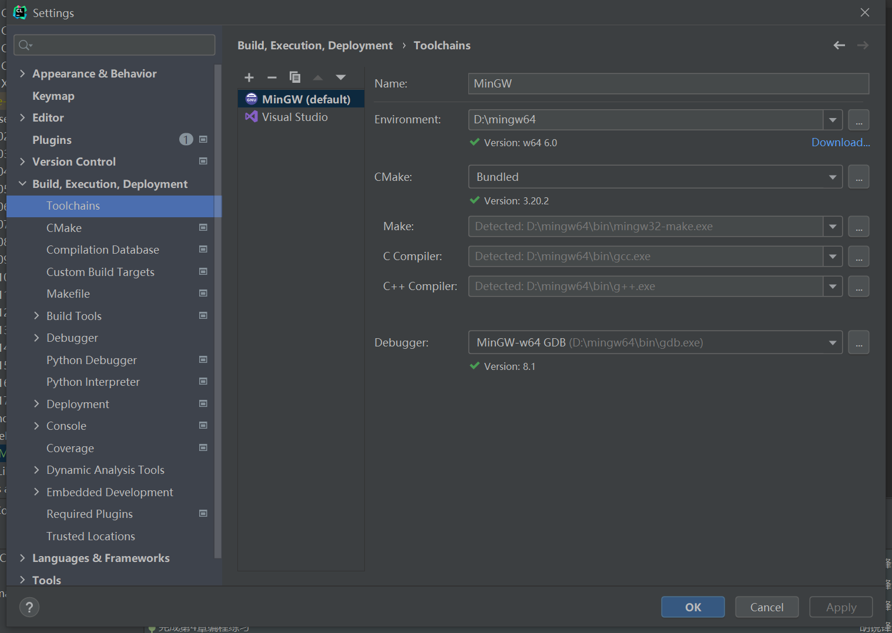

# 《深入理解计算机系统》学习笔记

## 在线阅读地址
https://relph1119.github.io/csapp-notes/#/

## 运行环境
**IDE：**CLion 2021.2版本   
**Toolchains：**MinGW 6.0  
**Debugger：**MinGW-w64 8.1

### 配置\[C/C++ IDE\]CLion
https://www.cnblogs.com/bluestorm/p/12316676.html




### 本地启动docsify
```shell
docsify serve ./docs
```

## 参考资料
【1】[Datawhale开源408计划——《深入理解计算机系统》](https://github.com/datawhalechina/team-learning-program/tree/master/ComputerSystems)

## LICENSE
<a rel="license" href="http://creativecommons.org/licenses/by-nc-sa/4.0/"></a><br />本作品采用<a rel="license" href="http://creativecommons.org/licenses/by-nc-sa/4.0/">知识共享署名-非商业性使用-相同方式共享 4.0 国际许可协议</a>进行许可。